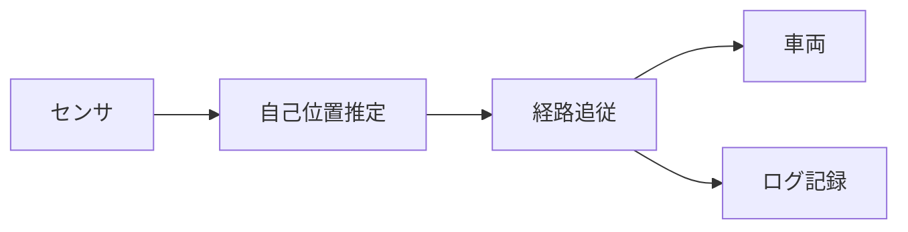

# Slidev入門

このスライド自体が教材。左でMarkdownを編集し、右のブラウザで即反映を確かめながら進める

<div class="mt-8 text-sm opacity-70">
→ / Space で次へ、← で戻る、<kbd>o</kbd> で一覧、<kbd>f</kbd> で全画面、<kbd>d</kbd> でダーク切替
</div>

<!--
ここはプレゼンターノート。発表者ビュー(URL末尾に /presenter)にだけ表示される。
このスライドを開いた状態で /presenter を開いて、この文が出ることを確認してみる。
-->

---

## 進め方

1. ターミナルで `slidedev` → このデッキを選ぶ(ブラウザが開く)
2. 別ペインで `nvim ~/slides/decks/2026-09-21-slidev-tutorial/slides.md`
3. 各スライドの **🔧 演習** を編集 → 保存 → ブラウザが自動で更新されるのを確認

🔧 **演習**: まずこの行の末尾に好きな文字を足して保存し、反映されることを確かめてみる。

---

## スライドの区切り

スライドは空行を挟んだ `---` で区切る。ファイル先頭のブロックは**全体設定(headmatter)**。

````md
---
theme: default      # ← ファイル先頭だけが全体設定
---

# 1枚目

---

# 2枚目
````

`---` の直後に設定を書くと、**そのスライドだけの設定**になる(次ページで使う)。

---
layout: two-cols
---

## 2カラム

このスライドの先頭には

````md
---
layout: two-cols
---
````

と書いてある。`::right::` から下が右カラムになる。

::right::

## 右カラム

- 図と説明を並べるときに使う
- 比率を変えたいときは `layoutClass` で調整

🔧 **演習**: `layout: two-cols` を `layout: default` に変えて、崩れ方を見てから戻す

---
layout: center
class: text-center
---

# `layout: center` は中央寄せ

章の区切りやまとめに使う

---
layout: center
class: text-center
---

## 自分で足したスライド

hogehoge

---

## 文字装飾とレイアウト調整

SlidevはUnoCSS(Tailwind互換)のクラスがそのまま使える。

<div class="text-2xl text-blue-600 font-bold">text-2xl text-blue-600 font-bold</div>
<div class="opacity-50 text-sm mt-2">opacity-50 text-sm mt-2</div>

<div class="grid grid-cols-3 gap-2 mt-4">
  <div class="p-2 bg-gray-100 rounded">grid</div>
  <div class="p-2 bg-gray-100 rounded">grid-cols-3</div>
  <div class="p-2 bg-gray-100 rounded">gap-2</div>
</div>

🔧 **演習**: `grid-cols-3` を `grid-cols-2` に変えて並びが変わることを確かめる

---

## クリックで順に見せる {.text-red-500}

<v-clicks>

- 1クリック目で出る
- 2クリック目で出る
- 3クリック目で出る
- 4クリック目で出る

</v-clicks>

<div v-click class="mt-4 p-2 bg-yellow-100 rounded">
  <code>v-click</code> は要素単位でも使える
</div>

🔧 **演習**: 箇条書きを1行足して、クリック数が増えることを確認する

<!-- 発表者ビューでは、次に何が出るかを事前に確認できる -->

---

## コードと行ハイライト

```python {2|3|all}{lines:true}
def predict(x, u, dt):
    x_pred = x + u * dt          # 予測ステップ
    return x_pred                # クリックごとにハイライトが移る
```

- `{2}` … 2行目を強調
- `{2|3|all}` … クリックのたびに強調行が移る
- `{*}{maxHeight:'200px'}` … 長いコードはスクロールさせる

🔧 **演習**: `{2|3|all}` を `{3|2}` に変えて、順番が入れ替わることを見る

---

## 数式(KaTeX)

インラインは `$...$`、ブロックは `$$...$$`。

状態遷移: $x_{k+1} = f(x_k, u_k) + w_k$

$$
P_{k+1}^- = F_k P_k F_k^\top + Q_k
$$

観測方程式: $y = Hx + v$

🔧 **演習**: $y = Hx + v$ を自分で1つ書き足してみる

---

## 図(Mermaid)



- ` ```mermaid {scale: 0.9} ` の `scale` で大きさを調整する
- 日本語ラベルもそのまま使える

🔧 **演習**: ノードを1つ足して矢印をつなぐ

---

## 画像

デッキのフォルダからの相対パスで置く。サイズを指定したいときはHTMLで書く。

````md


````

このデッキには `images/` フォルダを用意してある。スクリーンショットを置いて試す。


🔧 **演習**: 適当な画像を `images/` に入れて貼り、`w-80` を `w-40` に変えてみる

---

## 書き出しと発表

| やること | コマンド / 操作 |
|---|---|
| 発表する | `slidedev` → `f` で全画面 |
| 発表者ビュー | URL末尾に `/presenter`(ノートと経過時間が出る) |
| PDF/PPTX/PNG | `slideexport` でデッキと形式を選ぶ |
| アニメーションもPDFに残す | `npx slidev export ... --with-clicks` |

🔧 **演習**: `slideexport` でこのデッキをPDFにして、`images/` と並んで出力されることを確認する

---
layout: center
class: text-center
---

# 次のステップ

記法の早見表: `docs/slidev-cheatsheet.md`(nvimで `<leader>sh`)

公式ドキュメント: [sli.dev](https://sli.dev/)

新しい資料は `slidenew <タイトル>` から
