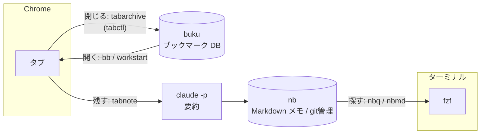

<div class="relative px-14 pt-12">

  <div class="mt-14">
    <h1 class="!text-5xl !font-black !leading-tight text-sky-700">ターミナル+CLIによる<br>ブックマーク・タブの整理整頓術</h1>
    <div class="mt-5 text-lg font-bold text-gray-400">Terminal Night 3 2026.10.15</div>
  </div>

  <div class="absolute left-14 top-[420px] flex items-center gap-5">
    
    <div>
      <div class="text-xl font-bold">Shisato Yano</div>
      <div class="text-sm text-gray-400">自動運転システムエンジニア</div>
    </div>
  </div>
</div>

<!--
[0:00-0:20] 挨拶だけ。すぐ次へ。
-->

---

## 自己紹介

- **Shisato Yano**
- 自動運転システムを開発するソフトウェアエンジニア
- 開発環境は WezTerm + Neovim + Claude Code、ほぼターミナルに住んでいる
- dotfiles を公開しています → `github.com/ShisatoYano/dotfiles`

<!--
[0:20-0:50] 短く。「ターミナルに住んでいるのに、ブラウザだけマウス操作のまま残っていた」という次の話へつなぐ。
-->

---

## 困っていたこと

<v-clicks>

- 🗂️ **タブが溜まり続ける** — 「あとで読む」が閉じられず、気づくと数十枚に
- 🫥 **読んだ内容を忘れる** — ブックマークはURLだけで、何が書いてあったかが残らない
- 🔁 **毎朝同じページを手で開く** — タスク管理、勤怠、Slack、カレンダー、メール…

</v-clicks>

<div v-click class="mt-10 text-xl">

👉 ブラウザは**表示するだけ**にして、<br>
**開く・閉じる・残す・探す**はターミナルとキーボードで行う

</div>

<!--
[0:50-1:40] 聴衆にも心当たりを聞く感じで。最後の一文がこの発表の主張。
-->

---

## 全体像



<div class="text-sm">

| ツール | 役割 |
|---|---|
| [buku](https://github.com/jarun/buku) | CLI のブックマーク管理(SQLite) |
| [tabctl](https://github.com/slastra/tabctl) | ターミナルからブラウザのタブを一覧・操作する(要ブラウザ拡張) |
| [nb](https://github.com/xwmx/nb) | Markdown のメモを git で管理する CLI |

</div>

<!--
[1:40-2:40] 各ツールの役割を一言ずつ。これから「開く→閉じる→残す→探す」の順で、タブの一生に沿って見ていく。
-->

---

## ① 開く — `bb` / `workstart`

```bash {all|3|9-12}
# bukuのブックマークをfzfであいまい検索してブラウザで開く(Tabキーで複数選択可)
bb() {
  urls=$(buku --nostdin -p -f4 --nc | fzf --reverse --multi --preview ... | cut -f2) || return
  while IFS= read -r url; do xdg-open "$url" >/dev/null 2>&1 & done <<< "$urls"
}

# 毎朝開くページは、bukuで "*_check" タグを付けておけば一括で開ける
workstart() {
  buku --nostdin -p -f4 --nc | awk -F'\t' '
    { n = split($4, tags, /[ ,]+/)
      for (i = 1; i <= n; i++) if (tags[i] ~ /_check$/) { print $2; break } }' | ...
}
```

- 「毎朝開くページ」をコードに直書きせず、**ブックマークのタグ**で管理する
- 開くページを増やすときは `buku` でタグを付けるだけで済む

<!--
[2:40-3:40] workstartのポイントは、開くページの一覧をスクリプトではなくデータ(タグ)側に持たせたこと。
-->

---

## ② 閉じる — `tabarchive`

```bash {all|1|4-5|8-9|11}
tabctl list | fzf --multi | while IFS=$'\t' read -r id title url; do
  ...
  # 登録済みのURLは保存しない(タブのタイトルは未読件数などですぐ変わるので、比較はURLだけで行う)
  if grep -Fxq "$url" <<< "$existing"; then echo "skip (既存): $title"
  else
    # タイトルを省略するとbukuがページを取りに行き、失敗すると
    # 「429 Too Many Requests」がそのままタイトルになるため、タブのタイトルを渡す
    buku --nostdin -a "$url" tab-archive --title "$(_tab_title_clean "$title")"
  fi
  tabctl close "$id"
done
```

- <strong>「閉じる前に保存する」</strong>を1つの操作にすれば、迷わずタブを閉じられる
- `_tab_title_clean` で `(9+) ` のような未読件数をタイトルから除く

<!--
[3:40-4:40] 429がタイトルになった話は実際に踏んだ。小さな失敗談として話す。
-->

---

## ③ 残す — `tabnote`

<div class="grid grid-cols-2 gap-6">
<div>

```bash
tabnote() {
  tabctl list | fzf --multi \
    | _tabarchive_process summarize
}
```

1. bukuに保存
2. nbの `tab-archive` ノートブックにメモを作る
3. `claude -p` でページを要約してメモに追記する
4. タブを閉じる

**要約に失敗したタブは閉じずに残す**<br>
→ タブが残っていれば、取りこぼしだとわかる

</div>
<div>

<!-- TODO: tabnote の録画GIFに差し替える(./images/tabnote.gif) -->
<div class="h-72 border-2 border-dashed rounded flex items-center justify-center opacity-60">
GIF: tabnote デモ
</div>

</div>
</div>

<!--
[4:40-6:10] この発表の山場。GIFを流しながら説明する。claude -p の待ち時間は録画で早送りしておく。
「閉じる前に要約まで済ませる」ことで、ブックマークがURLだけのものではなく読んだ内容の記録になる。
-->

---

## ④ 探す — `nbq` / `nbmd`

<div class="grid grid-cols-2 gap-6">
<div>

```bash
fzf --ansi --disabled \
  --bind "change:reload:$rg_cmd || true" \
  --preview 'cat {1}' \
  --preview-window='right:60%:+{2}-5'
```

- fzf のあいまい検索は**使わない**(`--disabled`)
  - 本文全体を渡すと、文字が飛び飛びに一致したノートが大量に並ぶ
- 入力が変わるたびに **ripgrep を実行し直して**絞り込む
- ファイル名での一致も、本文ヒットと同じ形式で先頭に並べる
- `nbq` は Neovim で編集、`nbmd` は mdroll でプレビュー

</div>
<div>

<!-- TODO: nbq の録画GIFに差し替える(./images/nbq.gif) -->
<div class="h-72 border-2 border-dashed rounded flex items-center justify-center opacity-60">
GIF: nbq デモ
</div>

</div>
</div>

<!--
[6:10-7:30] fzf の reload を使った定番の組み方。--disabled にした理由を強調する。
-->

---

## ⌨️ ブラウザ側もキーボードで — Vimium

```vim
" デフォルトのH/L(履歴の戻る/進む)はh/lへ移す
map h goBack
map l goForward

" 空いたH/Lは、Neovimのバッファ移動(S-h/S-l)と同じ指の動きでタブ移動に割り当てる
map H previousTab
map L nextTab
```

- **ターミナルとブラウザで同じキーが同じ意味になる**ように揃える
- 残ったマウス操作も、こうしてキーボードに寄せていく

<!--
[7:30-8:10] Keyboard側のテーマに触れる1枚。短く。
-->

---

## ハマりどころ

<v-clicks>

- **nb のスピナーが標準出力に混ざってパスが壊れる**
  - nbは、ノートブックにコミットしていない変更があるとスピナーを表示する
  - `path=$(nb show ... --path)` で受けた値にスピナーの文字が混ざった
  - → nbは標準入力が端末のときだけスピナーを出すので、`< /dev/null` をつなぐ
- **ループの中で `nb add` がタブ一覧を食べる**
  - `nb add` はパイプされた標準入力をノートの本文として読む
  - → ここでも `< /dev/null` をつなぐ
- **nb は絶対パスをカレントのノートブック内でしか解決できない**
  - → `ノートブック名:相対パス` の識別子で受け渡す

</v-clicks>

<!--
[8:10-9:20] 標準入力まわりで2回ハマった話。ターミナル好きの聴衆に一番響くところ。
-->

---
layout: center
class: text-center
---

# まとめ

ブラウザは**表示するだけ**、操作はターミナルとキーボードで行う

| 開く | 閉じる | 残す | 探す |
|:-:|:-:|:-:|:-:|
| `bb` / `workstart` | `tabarchive` | `tabnote` | `nbq` / `nbmd` |

<div class="mt-8">

設定はすべて公開しています 👉 **github.com/ShisatoYano/dotfiles**<br>
(`shell/aliases.sh`)

</div>

<div class="mt-6 opacity-60">ご清聴ありがとうございました #terminalnight</div>

<!--
[9:20-10:00] 4つの操作をもう一度並べて締める。
-->
